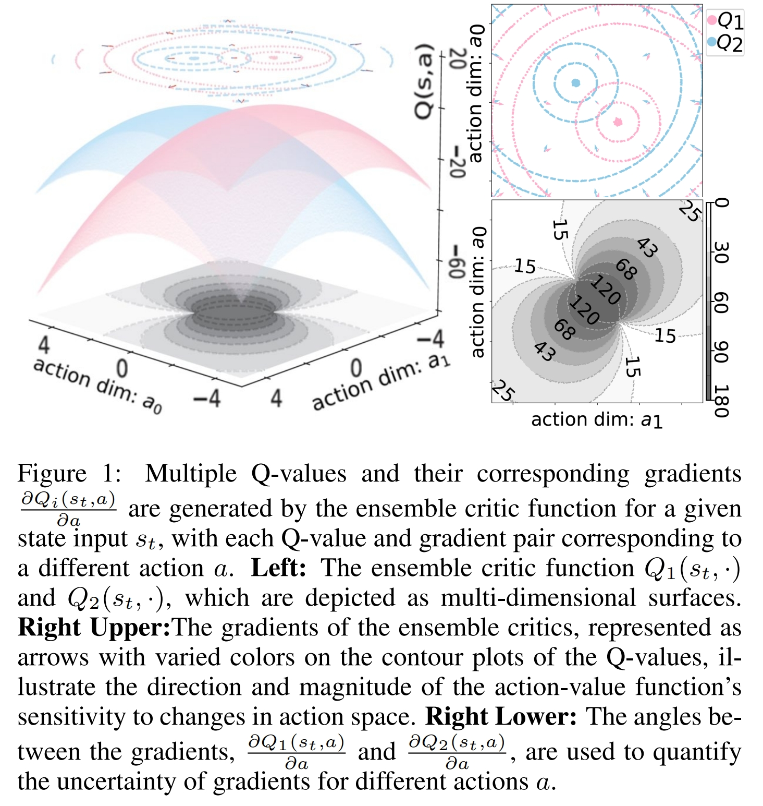

# vMFER: Von Mises-Fisher Experience Resampling Based on Uncertainty of Gradient Directions for Policy Improvement

We visually illustrate the gradient disagreement during the learning process of an ensemble structure RL algorithm using a simple example.


We demonstrate the benefits of considering the Uncertainty of Gradient Directions for Policy Improvement through a toy experiment.


This repository contains the PyTorch implementation of vMFER. If you use our code or data, please cite our [paper](https://arxiv.org/abs/2405.08638).

We have integrated vMFER into the publicly available TD3 code to showcase its specific implementation.

The method has been tested on [MuJoCo](http://www.mujoco.org/) continuous control tasks within the [OpenAI Gym](https://github.com/openai/gym) environment. Networks are trained using [PyTorch 1.10](https://github.com/pytorch/pytorch) and Python 3.7.

### Usage

To reproduce the results from the paper, run the following command:
```
python Common_run.py
```
All parameters can be adjusted by modifying the corresponding entries in the `config.json` file.

### Results

Numerical results can be found in [this paper](https://arxiv.org/abs/2405.08638).

### Bibtex

```
@inproceedings{DBLP:conf/ijcai/Zhu0WFHF0HLF24,
  author       = {Yiwen Zhu and
                  Jinyi Liu and
                  Wenya Wei and
                  Qianyi Fu and
                  Yujing Hu and
                  Zhou Fang and
                  Bo An and
                  Jianye Hao and
                  Tangjie Lv and
                  Changjie Fan},
  title        = {vMFER: Von Mises-Fisher Experience Resampling Based on Uncertainty
                  of Gradient Directions for Policy Improvement},
  booktitle    = {Proceedings of the Thirty-Third International Joint Conference on
                  Artificial Intelligence, {IJCAI} 2024, Jeju, South Korea, August 3-9,
                  2024},
  pages        = {5725--5733},
  publisher    = {ijcai.org},
  year         = {2024},
  url          = {https://www.ijcai.org/proceedings/2024/633},
  timestamp    = {Fri, 18 Oct 2024 20:54:08 +0200},
  biburl       = {https://dblp.org/rec/conf/ijcai/Zhu0WFHF0HLF24.bib},
  bibsource    = {dblp computer science bibliography, https://dblp.org}
}
```
